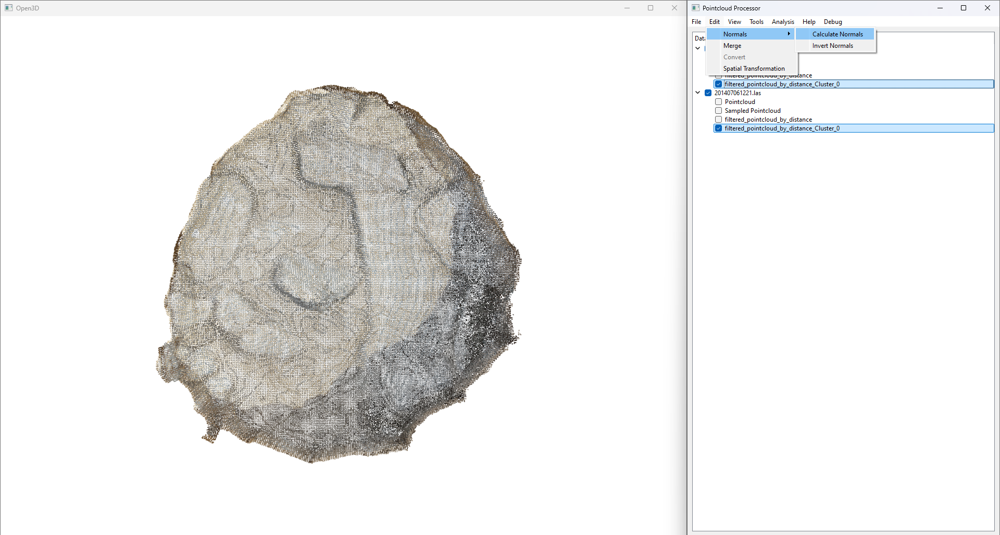

# Example 1: Solid Fill Between Two Point Clouds  

In this example, we will take two point clouds and process them to generate a solid fill between them. This is useful in cases where we have two point clouds that together represent a watertight solid entity, and a solid object is needed for modelling, analysis, or 3D printing.  

The process involves several key steps, outlined below:  

---

## **Workflow Overview**  
1. **Import Point Clouds** – Load the point cloud data into the workspace.  
2. **Sample Point Clouds** – Reduce the number of points while maintaining structure.  
3. **Apply Between-Distance Filter** – Remove points outside a defined distance threshold.  
4. **Perform DBSCAN Clustering** – Identify meaningful clusters and eliminate noise.  
5. **Compute Normals** – Calculate surface normals for accurate reconstruction.  
6. **Reconstruct Surface** – Generate a solid surface using Poisson Surface Reconstruction.  
7. **Export Final Model** – Save the processed model for further use.  

---

## **Step 1: Import Point Clouds**  

To begin, import the two point clouds into the workspace. These could be obtained from a 3D scanner, photogrammetry software, or other point cloud sources.  

📌 **Important Notes:**  
- Ensure that the point cloud files are in a compatible format (e.g., `.ply`, `.pcd`, `.xyz`).  
- Select the point cloud in the **menu pane** before applying any processing steps.  
- Some processes, such as filtering, can be applied to multiple point clouds at the same time.  

📌 *Example input point clouds:*  
  

---

## **Step 2: Sample Point Clouds**  

Sampling reduces the number of points in the dataset while preserving the overall structure. This is essential for optimising performance and preventing excessive computation times.  

### **Available Sampling Methods:**  
- **Random Sampling** – Selects a specified percentage of points randomly.  
- **Regular Sampling** – Selects every nth point based on a user-defined percentage.  
- **Voxel Downsampling** – Groups nearby points into voxel grids, reducing density while maintaining shape.  

---

### **Understanding Voxel Downsampling**  

Voxel downsampling works by dividing the space into a **3D grid of voxels** (small cubes of a fixed size). Each voxel can contain multiple points from the original cloud.  

📌 **How It Works:**  
1. The entire point cloud is overlaid with a voxel grid of a specified size (e.g., 0.01m, 0.05m).  
2. If multiple points fall within a single voxel, only **one representative point** is kept.  
3. The representative point is typically the **centroid (average position)** of all the points in that voxel.  

### **What Happens If Multiple Points Fall in the Same Voxel?**  

- **Centroid Calculation**: The new point is placed at the **average position** of all points in the voxel.  
- **Data Loss Consideration**: If fine details are critical, using too large a voxel size may remove important features.  
- **Noise Reduction**: Since outlier points are blended into voxel groups, small noise variations are naturally smoothed out.  

🔹 **Example:** If **three points** `(X1, Y1, Z1)`, `(X2, Y2, Z2)`, and `(X3, Y3, Z3)` fall within a voxel, the new retained point is calculated as:  

\[
X_{new} = \frac{X1 + X2 + X3}{3}, \quad Y_{new} = \frac{Y1 + Y2 + Y3}{3}, \quad Z_{new} = \frac{Z1 + Z2 + Z3}{3}
\]

📌 **Choosing the Right Voxel Size:**  
- **Small voxel size (e.g., 0.001m - 0.005m)** → Preserves fine details but results in a larger dataset.  
- **Medium voxel size (e.g., 0.01m - 0.02m)** → Good balance between detail retention and performance.  
- **Large voxel size (e.g., 0.05m or more)** → Reduces data size significantly but may remove important features.  

📌 *Sampled point clouds:*  
  

---

## **Step 3: Apply Between-Distance Filter**  

The between-distance filter is a crucial step to refine the point cloud by removing points that lie outside a specific distance threshold between the two clouds. This ensures that only points which are relevant for creating the final solid model are retained. The filter helps to eliminate irrelevant data that might interfere with the solid reconstruction process, such as points from other objects or noise that is far from the target area of interest.

### **Why Use a Between-Distance Filter?**
When working with point clouds that represent two different objects or parts of the same object, there can be unwanted points that do not contribute to the desired shape. The **between-distance filter** helps to isolate points that are within a defined distance from each other, focusing only on points that are geometrically close. This is particularly important in situations where the point clouds may contain extraneous data due to scanning noise or overlapping from different perspectives.

### **How It Works:**
1. **Define Distance Threshold:**
   - First, you need to specify a **distance range** within which points from both point clouds should be considered. For instance, if two point clouds represent different parts of a mechanical object, setting a distance threshold will ensure that only points from the parts that are close to each other are kept.
   - Points that fall **outside** this range will be discarded, as they are considered irrelevant or part of an entirely different object.

2. **Apply Distance Filter:**
   - The filter is applied by calculating the **Euclidean distance** between each point in one cloud to the closest point in the other cloud.
   - For example, if the distance between a point in Point Cloud A and the closest point in Point Cloud B is greater than the specified threshold, that point in Cloud A will be removed. Similarly, the points from Point Cloud B that are outside the distance threshold relative to Point Cloud A will be removed as well.

3. **Preserve Relevant Points:**
   - After applying the filter, the points that remain in the dataset are those that are within the distance threshold, ensuring that only points that are relevant to each other stay in the dataset. This step is crucial for removing isolated or noise points that don't belong to the area of interest.

### **Distance Calculation Formula:**

For each pair of points \(P_1 = (x_1, y_1, z_1)\) from Point Cloud A and \(P_2 = (x_2, y_2, z_2)\) from Point Cloud B, the Euclidean distance is calculated as:

\[
D = \sqrt{(x_2 - x_1)^2 + (y_2 - y_1)^2 + (z_2 - z_1)^2}
\]

If the distance \(D\) is less than or equal to the predefined threshold, the points are retained; otherwise, they are discarded.

### **Choosing the Right Distance Threshold:**
The choice of distance threshold will depend on the scale of the point cloud data and the nature of the objects being reconstructed. Here's a general guide:

- **Small threshold (e.g., 0.01m to 0.05m):** Best for point clouds representing finely detailed objects or when you need to preserve only points that are very close to each other, such as when reconstructing small, intricate features.
- **Medium threshold (e.g., 0.1m to 0.5m):** Suitable for general object reconstruction where moderate proximity between points is enough to define a coherent surface.
- **Large threshold (e.g., 1m or more):** Used when the point clouds represent large structures or landscapes, where a broader range of point proximity is acceptable for merging the data.

### **Key Considerations:**
- **Outliers Removal:** By setting a reasonable threshold, this filter helps in removing outliers that are far from the main point cloud. This is crucial to avoid errors in surface reconstruction caused by irrelevant points.
- **Data Integrity:** Make sure the threshold is chosen such that no essential details from the object are lost. Too large of a threshold could lead to data fusion where irrelevant points are mistakenly included.

### **Practical Example:**

Imagine you have two point clouds representing the left and right sides of a 3D scanned car. Without a distance filter, you might have points from both sides of the car that are far apart and should not be included in the same model. By applying a distance threshold of, say, **0.5 metres**, only points that are within 0.5 metres of each other between the two sides of the car are retained. Points outside this range are considered noise and removed.

📌 **Filtered point clouds:**  

---

## **Step 4: Perform DBSCAN Clustering**  

DBSCAN (Density-Based Spatial Clustering of Applications with Noise) is a popular clustering algorithm used to identify groups of closely related points in a dataset, while also effectively handling noise and outliers. Unlike traditional clustering algorithms like k-means, DBSCAN does not require specifying the number of clusters in advance. Instead, it groups points based on density, making it particularly useful for 3D point clouds, where the number of clusters might not be known beforehand.

How DBSCAN Works  
DBSCAN groups points based on the concept of density—the number of neighbouring points within a specified distance. The algorithm uses two key parameters:

Epsilon (ε) – This parameter defines the maximum distance between two points for them to be considered neighbours. In essence, if two points are within this distance, they are part of the same cluster.
MinPts – This defines the minimum number of points that must exist within the epsilon radius for a point to be considered a core point. Core points are the centre of a cluster.
Points are classified into three categories:

Core points: Points that have at least MinPts neighbours within the epsilon distance. These points are part of a cluster.
Border points: Points that have fewer than MinPts neighbours within epsilon but are still within the neighbourhood of a core point.
Noise points (Outliers): Points that are neither core nor border points and do not belong to any cluster.
DBSCAN Process:
Initialisation: The algorithm starts by randomly selecting an unvisited point.
Neighbourhood Search: It looks for the point's neighbours within the epsilon distance. If the number of neighbours is greater than or equal to MinPts, the point is classified as a core point.
Cluster Expansion: All points that are reachable from the core point (i.e., points within epsilon distance) are added to the cluster. The process is repeated for the newly added points to expand the cluster.
Noise Detection: Points that are not within the epsilon range of any core point are marked as noise and are excluded from any clusters.
Termination: The algorithm repeats the process until all points are either assigned to a cluster or classified as noise.
Advantages of DBSCAN
No need to specify the number of clusters: Unlike other clustering algorithms, DBSCAN does not require you to pre-define the number of clusters.
Identifies outliers: DBSCAN automatically detects noise and outliers in the dataset, making it particularly useful for messy or sparse point clouds.
Works well with non-spherical clusters: The density-based approach allows DBSCAN to find arbitrarily shaped clusters, which is ideal for many 3D scanning applications.
DBSCAN in Action:
In point cloud processing, DBSCAN is particularly useful for separating meaningful structures from noise or sparse regions. After applying DBSCAN, you'll have a series of clusters that represent coherent groups of points, which you can further analyse or process.

Practical Application
Noise Removal: The first step is to remove noise by eliminating the points that are classified as outliers.
Cluster Identification: The remaining points are grouped into clusters, each representing a distinct object or feature in the point cloud.
Cluster Cleanup: From here, you can remove unwanted clusters (such as small or irrelevant ones) and retain only the clusters that represent the main features of interest.

📌 *DBSCAN applied:*  
  

📌 *Clustered points:*  
  

📌 *Cleaned point cloud:*  
  

📌 *Further cleaned result:*  
  

---

## **Step 5: Compute Normals**  

Surface normals are vectors that represent the orientation of a surface at each point in a point cloud. In simple terms, a normal indicates the direction that a surface is facing at a given point. When working with point clouds, calculating accurate normals is essential for understanding the surface geometry and enabling effective surface reconstruction.

Normals are particularly important for the next step in the process—surface reconstruction. When generating a 3D model from a point cloud, the

📌 Visualise Normals:
You can use the shortcut 'N' to display the normals in your workspace, allowing for a quick inspection.

📌 *Computed normals:*  
  

📌 *Inverted normals (if needed):*  
  

---

## **Step 6: Surface Reconstruction**  

After cleaning and processing the point clouds, it’s time to merge them into a single cohesive dataset. This step combines the two point clouds, creating a unified point cloud that is ready for surface reconstruction. Once merged, a new point cloud will appear in the menu, allowing you to work with the consolidated dataset.

With cleaned point clouds and correctly oriented normals, the next step is to use Poisson Surface Reconstruction to generate a continuous, watertight surface from the point cloud. Poisson Surface Reconstruction is an advanced algorithm that fills in gaps, removes noise, and creates a solid, smooth surface that closely approximates the shape of the original scanned objects.

Poisson Surface Reconstruction Parameters
Poisson Surface Reconstruction allows for a high degree of control over the resulting model through several key parameters that influence the quality and appearance of the reconstructed surface:

Depth:
The depth parameter controls the resolution of the reconstructed surface. It defines the octree depth used in the reconstruction process. An octree is a hierarchical structure that divides space into smaller cubes. The depth value determines how many levels the octree has. Higher depths lead to finer surface detail but can also increase computational complexity.

Lower depth values (e.g., 6–8) generate quicker, lower-resolution models with less detail.
Higher depth values (e.g., 9–12) generate more detailed and accurate models but require more computation time and memory.
Width:
The width parameter influences the smoothness of the surface by controlling the amount of regularisation applied during reconstruction. This parameter helps control how tightly the algorithm fits the point cloud to the resulting surface. A larger width leads to a smoother and more generalised surface, while smaller values retain more details but may introduce noise or imperfections.

Lower width values (e.g., 0.1–0.5) will produce more detailed surfaces but might not handle noise as well.
Higher width values (e.g., 1.0–2.0) will generate smoother surfaces, ideal for models with less detail or less noise.
Scale:
The scale parameter determines the level of detail that the reconstruction algorithm preserves. It affects the algorithm's sensitivity to small variations in the data. Scale values are typically in the range of 1–10, with larger values resulting in a model that captures finer details and smaller features of the point cloud. A lower scale may ignore finer details and produce a smoother surface, while a higher scale will attempt to preserve every small feature, leading to a more intricate model.

Smaller scale values (e.g., 1–3) preserve fewer details and focus on broader, more general features of the point cloud.
Larger scale values (e.g., 4–8) preserve fine details, which is helpful when the point cloud captures intricate geometry or surface features.
How Poisson Surface Reconstruction Works
The Poisson Surface Reconstruction algorithm works by solving an implicit surface equation. This equation creates a surface that approximates the point cloud, smoothing over noise and gaps. The method uses normals to help define the surface orientation and fills in any holes by approximating the underlying geometry, ensuring the final model is watertight and continuous.

Once the parameters are set, the algorithm proceeds by constructing the implicit surface and then extracting a polygonal mesh from this surface. The result is a smooth, seamless 3D surface that represents the point cloud's overall shape and features.

Resulting Model
After the Poisson Surface Reconstruction is complete, the resulting model will have the following characteristics:

A smooth, continuous surface that approximates the original 3D object.
A watertight surface without gaps or holes.
A higher resolution model that preserves more geometric detail (depending on the chosen parameters).
📌 Poisson Reconstruction Output:
Once the reconstruction is done, the output surface will be displayed. You can now inspect the reconstructed surface for smoothness, completeness, and accuracy. If necessary, you can tweak the parameters (depth, width, scale) to adjust the output.
📌 *Poisson reconstruction output:*  
  

📌 *Final solid model:*  
  

---

## **Step 7: Export Final Model**  

Once surface reconstruction is complete, the final model can be exported.  

📌 **Export Format Options:**  

[//]: # (- `.stl` – Common for 3D printing.  )
[//]: # (- `.obj` – Useful for rendering and animation.  )
- `.ply` – Retains color and additional data.  
  

---

## **Summary**  

This example demonstrates how to process two point clouds and generate a solid fill between them using:  
✔️ Distance-based filtering  
✔️ Clustering and outlier removal  
✔️ Normal computation  
✔️ Poisson surface reconstruction  

These techniques allow for the creation of **high-quality solid models**, suitable for further use in various applications.  

---

