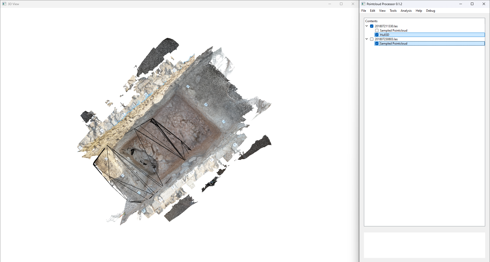
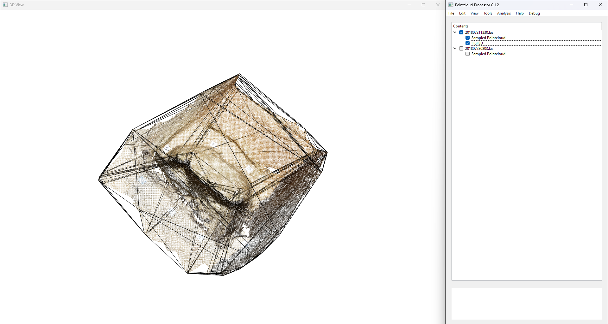
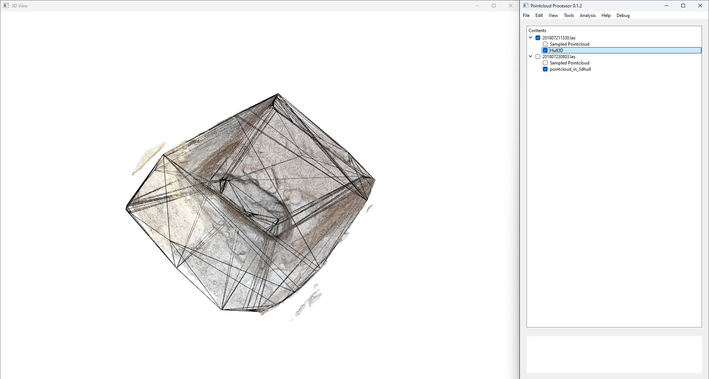
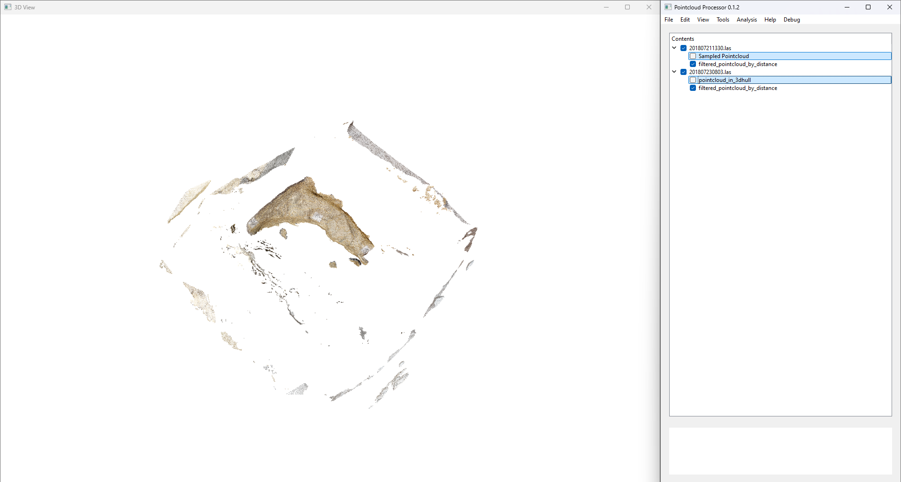
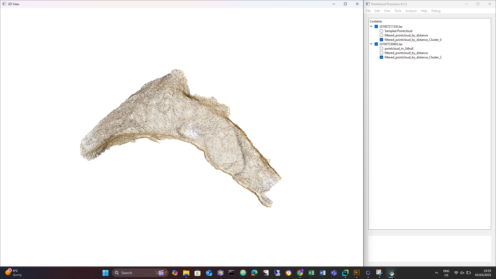
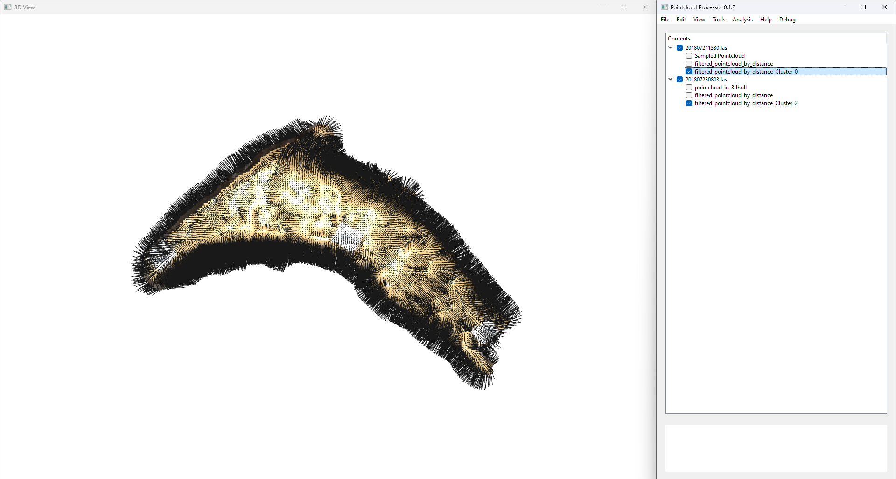

# Example 2: Filtering by 3D Convex Hull  

## Overview  
In this example, we start with a presampled dataset, similar to **Example 1**. However, in this case, one point cloud is significantly larger than the other, leading to a lot of redundant data. To efficiently reduce this excess data, we will apply a **3D convex hull-based filtering method** using the footprint of the smaller point cloud.  

This approach allows us to **retain only relevant points** from the larger point cloud while preserving important geometric features.  

---

## What is a Convex Hull?  

A **convex hull** is the smallest convex shape that completely encloses a set of points. In 2D, it can be visualized as a rubber band stretched around a group of points. In 3D, it forms a **tight-fitting outer shell** around a point cloud, similar to wrapping an object with shrink-wrap.  

**Why use a convex hull?**  
- It provides a well-defined boundary around a point cloud.  
- It helps in filtering out unnecessary points outside a region of interest.  
- It ensures efficient processing by reducing the dataset size while preserving relevant features.  

---

## Step 1: Generate a 3D Convex Hull  

The first step is to compute the **3D convex hull** of the smaller point cloud. This hull acts as a boundary that we will use to filter the larger point cloud.  

  

The image above shows the smaller point cloud along with its computed **3D convex hull**, which encloses all the points within a convex shape.  

A clearer view of the hull surrounding the point cloud:  

  

---

## Step 2: Filtering Points Using the Hull Footprint  

Now that we have the convex hull of the smaller point cloud, we will **filter the larger point cloud** to retain only the points that fall within its footprint.  

### How does this filtering work?  

1. **Flattening the 3D Hull to 2D**  
   - Instead of using the full **3D convex hull**, we project it onto a **2D plane (XY footprint)**.  
   - This means we **ignore the z-coordinate** when calculating the convex hull.  
   - The reason for this is that the feature of interest lies in the **horizontal plane**, and filtering in full 3D would incorrectly remove points above or below the structure we want to retain.  

2. **Filtering the Larger Point Cloud**  
   - Any points in the larger point cloud that **fall outside this 2D convex hull footprint** are discarded.  
   - The **z-coordinates of the retained points** remain unchanged after filtering.  

#### Why not use a full 3D convex hull?  
If we were to filter using the **full** 3D convex hull, we would risk **removing points above or below the feature of interest**, which is **not** what we want. Instead, by using the **2D footprint**, we ensure that all points within the horizontal boundary remain, while excess points outside the region are filtered out.  

The image below shows the **2D footprint of the convex hull** used for filtering:  

  

---

## Step 3: Continue the Normal Workflow  

Once we have filtered the larger point cloud, we proceed with the standard processing steps to refine and structure the dataset further.  

### 1. Apply a Between-Distance Filter  
After filtering, we apply a **between-distance filter** to remove any remaining outliers that may still be present.  

  

### 2. Use DBSCAN Clustering  
We then apply **DBSCAN (Density-Based Spatial Clustering of Applications with Noise)** to **identify and retain the points of interest**, grouping them into meaningful clusters.  

  

### 3. Assign Normals  
Next, we **compute and assign normal vectors** to the filtered point cloud. These normals help in further processing steps, such as meshing or surface reconstruction.  

  

### 4. Convert to a Solid  
Finally, we convert the processed point cloud into a **solid representation**, completing the workflow.  

---

## Summary  

In this example, we successfully **filtered a large point cloud** using the **3D convex hull footprint** of a smaller point cloud. This method helps in reducing redundant data while ensuring that we retain the key features of interest.  

**Key Takeaways:**  
- A **convex hull** provides a minimal bounding shape around a point cloud.  
- By filtering based on the **2D footprint**, we avoid unnecessary removal of points above or below the feature of interest.  
- After filtering, we continue the workflow with **distance filtering, clustering, normal assignment, and solid conversion** to finalize the dataset.  

This approach is a powerful way to efficiently **reduce noise and preserve key structures** in point cloud processing.  
