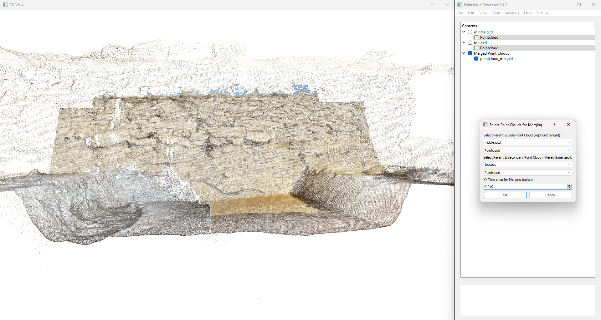
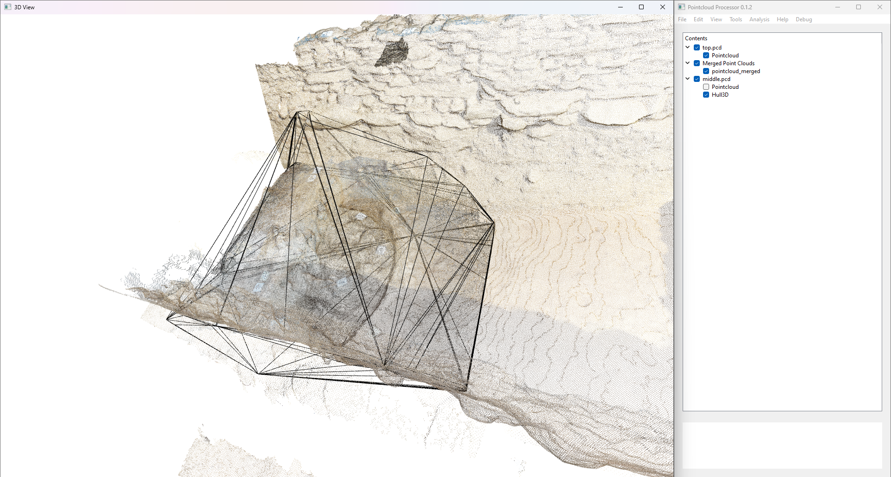
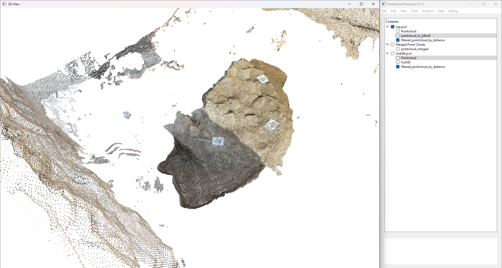
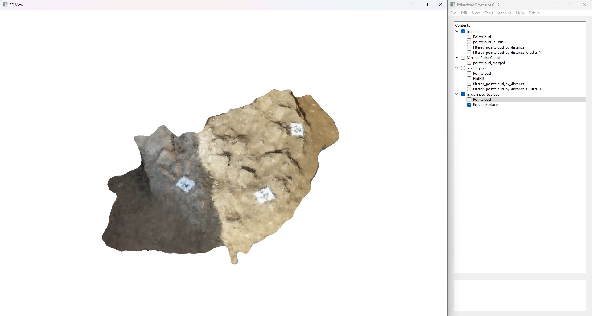
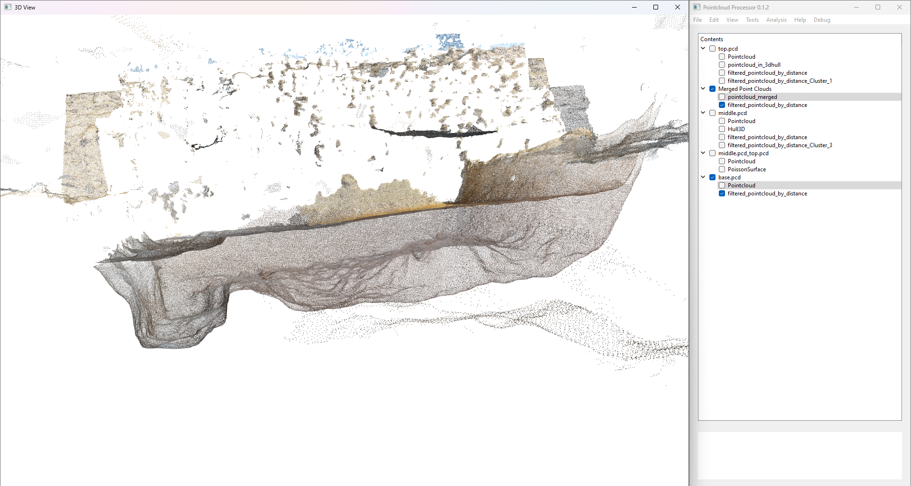
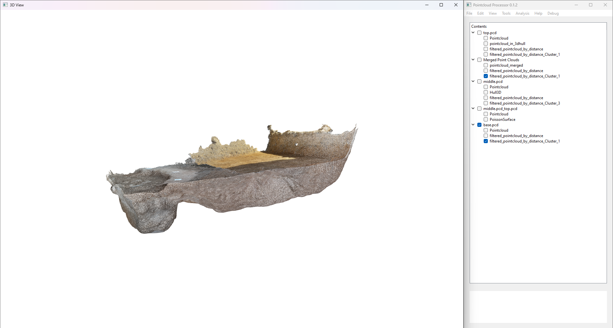
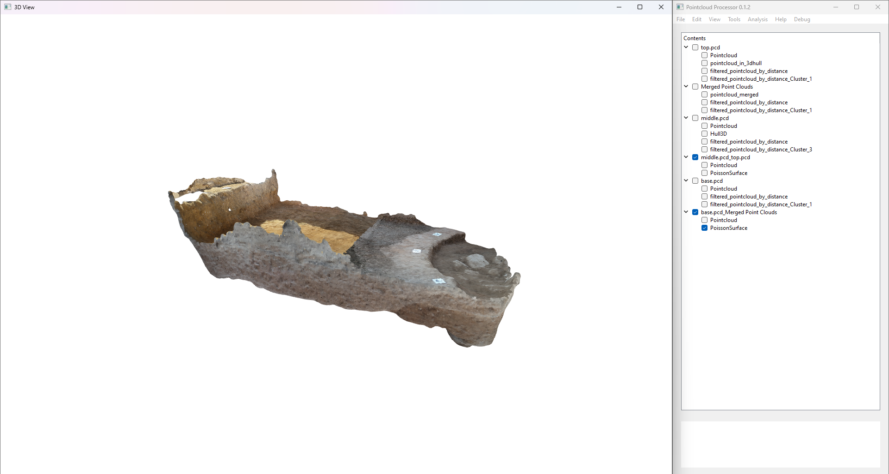
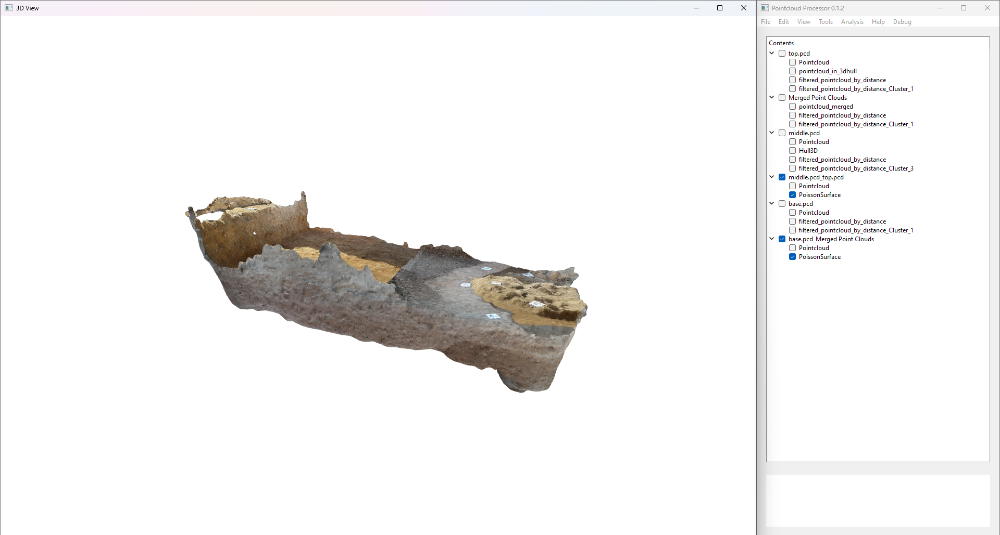

# Example 3: Point Cloud Substitution  [in development]  

## Overview  
In this example, we are dealing with **three interacting point clouds**, each representing different parts of the same surface. Point cloud data can often be incomplete, particularly when capturing complex geometries or features. In this case, one of the point clouds (the second) is missing sections of data due to a pit or cut in the surface. Our objective is to **substitute the missing parts of the second point cloud with points from the first point cloud**, ensuring that we maintain a complete surface model while preserving the topological integrity of the feature.

This process is an important aspect of **data completion** and **surface reconstruction** in 3D modeling, where partial datasets are common. By substituting missing data from a dataset that fully covers the same surface, we can ensure that the final model accurately reflects the entire geometry.

---

## Understanding the Problem  

We are working with **three point clouds** that represent different sections of the same surface. These point clouds are captured from different perspectives, with some missing data in certain areas. Below is a breakdown of the three point clouds:  

1. **First point cloud** – This dataset fully captures the **top surface** of the area. It covers all regions where the feature extends and is complete, providing a reference surface for the other datasets.  
2. **Second point cloud** – This point cloud represents the **base of a pit** that cuts into the top surface. While it captures the base geometry accurately, it does **not fully cover** the top surface in areas where the pit doesn't exist. This leads to **missing data** in the surrounding areas, which we need to substitute using the first point cloud.  
3. **Third point cloud** – This dataset captures the **full extent of the base** of the entire structure. It does not have a direct role in the substitution process but will become important for completing the model at a later stage.  

The second point cloud is missing parts of the surface, specifically where the pit does not intersect the first surface, which results in gaps. We aim to **substitute relevant points** from the first point cloud to fill these gaps and complete the surface.

Here is the initial visualisation of the three point clouds:  

  

In this visualisation, we can see the extent of the pit represented by the **blue point cloud**, and how the **red point cloud** fully covers the top surface, which will help us complete the geometry of the blue point cloud.

---

## Step 1: Visualising the Problem  

To gain a better understanding of the interaction between the point clouds, we assign **distinct colors** to each dataset. This color-coding helps us easily differentiate between the point clouds and see their relationships more clearly:  

- **Red** → First point cloud (Top surface)  
- **Blue** → Second point cloud (Pit base, incomplete)  
- **Green** → Third point cloud (Base of the entire structure)  

By color-coding the point clouds, we can visually observe how the **blue point cloud** (representing the pit) intersects with the **red point cloud** (the top surface). The **green point cloud** (base) is not relevant for substitution but will be used for later steps in the workflow.

  

From this visualisation, it’s clear that the **blue point cloud (pit base)** does not completely extend to the original surface captured in the red point cloud. The blue data is essentially the same as the red data in areas where there’s no pit, so we need to substitute the missing data from the red point cloud into the blue one.

---

## Step 2: Identifying Relevant Points for Substitution  

The key to this substitution process is identifying which sections of the **blue point cloud (pit base)** are incomplete and which points from the **red point cloud (top surface)** can be used to fill those gaps.  

1. **Identifying Missing Areas**:  
   - We start by examining the **blue point cloud** to identify the regions that are missing data, which typically occur around the boundary of the pit. These areas are visually or computationally determined by checking the differences between the two point clouds.  
   - A **convex hull** or other boundary-detection techniques can be applied to define the areas of the blue point cloud where data is missing.  

2. **Selecting Corresponding Points from the Red Point Cloud**:  
   - Once the missing regions in the blue dataset are identified, we look for **corresponding points** in the red dataset that cover the same surface. These are the points that will be substituted into the blue point cloud.  
   - The **proximity** of the points is key here: we need to ensure that the substituted red points are near the missing regions of the blue point cloud, preserving the overall geometry.

3. **Merging the Relevant Points**:  
   - The next step is **merging the selected points** from the red dataset into the blue dataset. This results in a new point cloud where the blue data is supplemented with points from the red dataset, filling in the gaps.
   - After substitution, we now have a **continuous middle layer** of the surface, combining the pit base data with the top surface data.  

The result of this substitution is a more complete point cloud, representing the **full surface geometry** that accounts for the pit feature.

Here is the resulting point cloud after substitution:  

  

---

## Step 3: Filtering and Refining the Point Cloud  

After successfully substituting the missing points, the next step is to **refine the dataset** by reducing unnecessary data and ensuring the point cloud is clean and ready for further processing. This includes **filtering out irrelevant points**, as well as **smoothing** and **consolidating** the data.  

### 1. Apply 3D Convex Hull to Reduce Data Size  
We begin by applying a **3D convex hull** based on the top point cloud (red) to define a **boundary** that captures the essential geometry. This convex hull will help to **cut down the size** of the point clouds by excluding points that fall outside the relevant surface area.  

The convex hull is a crucial step because it ensures that we focus only on the important points, discarding excess data that doesn’t contribute to the surface reconstruction.

  

### 2. Apply Distance Filter  
Next, we apply a **distance filter** to remove points that lie too far from the surface, which may be outliers or irrelevant to the feature we are modeling. By applying this filter, we improve the overall quality and accuracy of the model.

  

### 3. Compute Normals  
Once the point cloud is filtered, we proceed to compute **normals** for each point in the cloud. Normals are essential for surface reconstruction and modeling, as they define the orientation of the surface at each point. This step is necessary for ensuring that the final model is geometrically correct and ready for further processing.

  

---

## Step 4: Filtering and Refining the Base-Middle Context  

Once we’ve completed the top surface, we move on to the next phase: refining the **base-middle context**. This part of the model represents the interaction between the pit and the surrounding surface.

### 1. Apply Distance Filter  
As with the top surface, we apply a **distance filter** to the middle-base context to clean up the point cloud, removing any unnecessary points that might remain after the merging process.

  

### 2. Use DBSCAN to Clean the Point Clouds  
To further refine the dataset, we use **DBSCAN (Density-Based Spatial Clustering of Applications with Noise)**. DBSCAN is a powerful clustering algorithm that helps to identify and remove noise in the point cloud, leaving only the relevant data points. It is especially useful in situations where point clouds contain outliers or sparse regions.

  

### 3. Compute Normals, Merge, and Solidify  
After the data has been cleaned, we compute the **normals** again for the newly refined point cloud. This step is crucial for ensuring that the surface is well-defined and oriented properly. We then **merge** the cleaned point cloud and **solidify** the dataset into the final base-middle context, representing the fully refined surface.

  

---

## Step 5: Displaying Both Contexts Together  

Once both the **top context** and the **base-middle context** are processed and solidified, we can display both parts together for a comprehensive view of the entire surface. This gives us a complete model that incorporates both the pit base and the top surface, visualised together as two separate entities.

  

---

## Step 6: Continuing the Workflow  

Now that the substitution and refinement steps are complete, we can continue with the following steps in the workflow:  

1. **Apply additional filtering**: Continue refining the point cloud to remove any redundant or overlapping points.  
2. **Use clustering techniques** (such as DBSCAN) to further clean and cluster the dataset.  
3. **Assign normals** to all points to ensure proper surface reconstruction.  
4. **Integrate with the third (green) point cloud**, if needed, to complete the full model.  

At this point, the model is ready for further processing and analysis, or can be used in applications such as 3D visualisation or engineering simulations.

---

## Summary  

In this example, we demonstrated how to **substitute missing points** in an incomplete point cloud by using a full dataset that covers the same surface. This substitution process ensures that the geometry of the surface is accurately captured, even when parts of the original data are missing or incomplete.

**Key Takeaways:**  
- Point clouds often capture **incomplete surfaces** due to varying scanning conditions, and **substituting missing points** is an essential process to restore surface integrity.  
- By **identifying gaps in the point cloud** and **substituting relevant points**, we can ensure a **continuous and accurate surface model**.  
- This method is particularly useful for **reconstructing features** such as **pit bases, cuts, or holes**, ensuring that all parts of the surface are well-represented.  

By following this method, you can ensure that your point cloud data remains comprehensive and accurate for further analysis or modeling.
