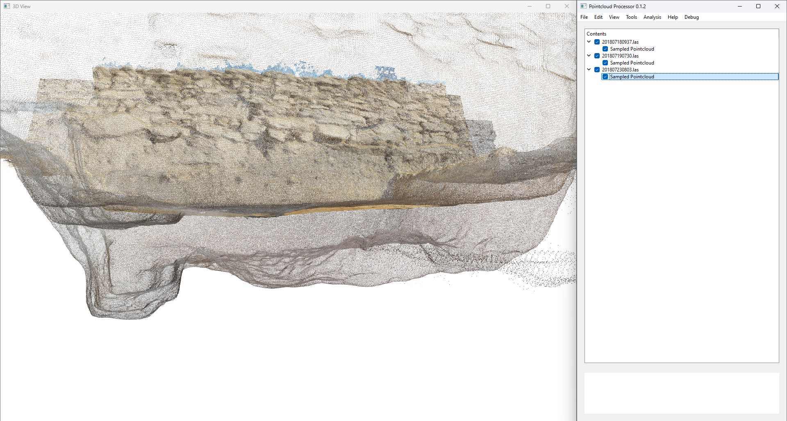
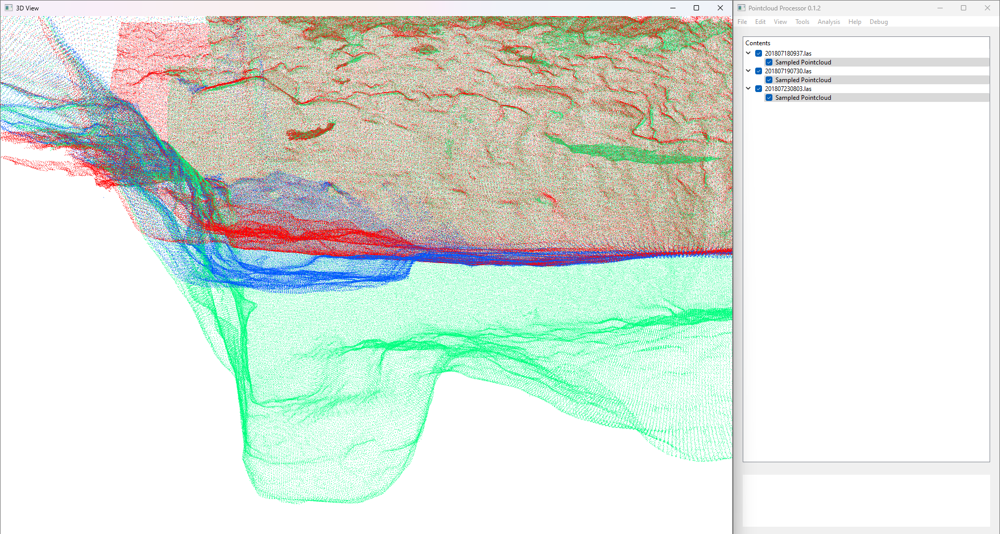

# Example 3: Point Cloud Substitution  [in development]

## Overview  
In this example, we are dealing with **three interacting point clouds**, each representing different parts of the same surface. However, one of them (the second point cloud) is incomplete, and we need to **substitute relevant points** from another dataset to fill in the missing areas.  

This process ensures that we **preserve the full surface geometry** while maintaining accuracy.  

---

## Understanding the Problem  

We have **three point clouds** in this scenario:  

1. **First point cloud (Red)** – Completely covers the **top surface** of the area.  
2. **Second point cloud (Blue)** – Represents the **base of a pit** that cuts into the surface.  
   - However, this dataset does **not fully extend** to the original surface.  
   - It records the base of the cut but leaves gaps.  
3. **Third point cloud (Green)** – Fully represents the **base of the entire structure** but is **not relevant** for this step.  

The missing data means that the second point cloud does not fully match the first point cloud’s surface. Therefore, we need to **substitute in relevant points from the first point cloud** to complete the missing sections.  

Here is the initial visualization of the three point clouds:  

  

---

## Step 1: Visualizing the Problem  

To better understand the data, we **color-code the point clouds**:  

- **Red** → First point cloud (Top surface)  
- **Blue** → Second point cloud (Pit base, incomplete)  
- **Green** → Third point cloud (Full base, not yet needed)  

With this color distinction, we can clearly see how the second point cloud records the feature cutting into the surface of the first point cloud.  

  

From this visualization, it is evident that the **blue point cloud (pit base) does not fully extend** to match the surface recorded in red. This is why we need to **substitute missing data from the red point cloud** into the blue one.  

---

## Step 2: Identifying Relevant Points for Substitution  

Since the second point cloud (blue) represents the **same surface** as the first point cloud (red) but lacks complete coverage, we need to:  

1. **Identify missing areas** in the blue point cloud.  
2. **Select corresponding points** from the red point cloud that fall within these gaps.  
3. **Merge the relevant points** from the red dataset into the blue dataset to create a continuous surface.  

This substitution ensures that the **pit base maintains the correct geometry** while filling in the missing areas.  

---

## Step 3: Implementing the Substitution  

### How does the substitution work?  

1. **Define the boundary of the missing region**  
   - Compute the convex hull of the **blue** point cloud.  
   - Identify areas where no points exist but should be present.  

2. **Find matching points in the red dataset**  
   - Search for red points **within and around the missing region**.  
   - Filter out unnecessary points to avoid duplicating data.  

3. **Merge and smooth**  
   - Integrate the selected red points into the blue dataset.  
   - Apply smoothing if necessary to maintain a continuous surface.  

---

## Step 4: Continuing the Workflow  

Once the substitution is complete, we can proceed with the **next steps in the workflow**:  

1. **Apply filtering** to remove redundant or overlapping points.  
2. **Use clustering techniques (e.g., DBSCAN)** to refine the substituted dataset.  
3. **Assign normals** to ensure proper surface reconstruction.  
4. **Integrate with the third (green) point cloud**, if required for the final model.  

---

## Summary  

In this example, we successfully **substituted missing points** in an incomplete point cloud using another dataset that covered the same surface.  

**Key Takeaways:**  
- Point clouds may **record the same surface differently**, leading to missing or incomplete data.  
- By **identifying gaps and substituting relevant points**, we can reconstruct a **more accurate surface representation**.  
- This method ensures that features such as **pit bases or cut surfaces** align correctly with the overall model.  
